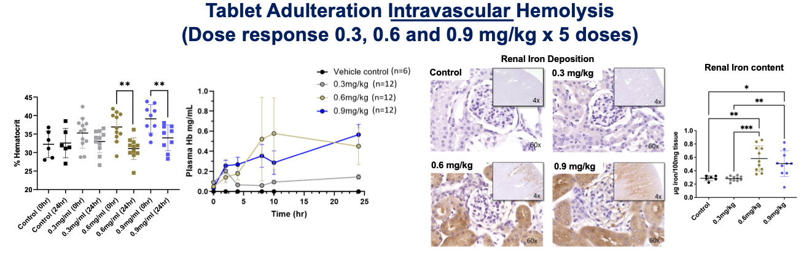

# Adulteration of Abuse Deterrent Formulas

A research project that I have been working on for a few years is an *in vivo* model to study **abuse deterrent formula** (ADF) adulteration. This project originates

## Background

Opioid tablet ADFs are designed to prevent unintended routes of administration. However, adulteration of ADF tablets to soluble and intravenous (IV) injectable material has become a method of aberrant use, and a cause of unique adverse effects independent of opioid toxicity. For example, the intravenous abuse of **Opana ER** is linked to a thrombotic microangiopathy (TMA) syndrome and renal complications. Studies in animals suggest that dosing with neat high molecular weight polyethylene oxide (PEO), the primary component of ADFs, can also cause toxicity consistent with TMA. Here, our objective was to better understand toxicological differences between neat PEO material (used in earlier studies) and complex adulterated tablet preparations formulated with PEO.

## Results

A dose-dependent decrease in hematocrit and an increase in plasma hemoglobin concentration was observed, consistent with intravascular hemolysis (Table 1). 

### Table 1. Time-dependent hemolysis in PEO-dosed guinea pigs
|Timepoint|7MDa|1MDa|Vehicle|
|---------|----|----|-------|
|Baseline |44.0|34.3|36.1   |
|Day 1    |36.0|37.4|37.8   |
|Day 3    |26.5|34.0|34.9   |
|Day 6    |21.0|38.7|34.4   |
|Day 9    |30.1|28.8|31.7   |
|Day 12   |21.5|31.3|35.5   |
|Day 15   |22.2|37.0|42.4   |

Gross morphology of transverse sectioned kidneys suggested hemoglobinuric kidney injury localized to the renal cortex. Perls iron staining with *diaminobenzidine* (DAB) intensification revealed iron deposition in proximal and distal tubules.

Aberrant red blood cell morphology was consistent with echinocyte accumulation in peripheral blood smears. Echinocytes are targeted for extravascular clearance through spleen red pulp macrophages and liver Kupffer cells. Perls DAB tissue staining identified spleen red pulp iron expansion and iron accumulation in Kupffer cells, consistent with increased phagocytosis of echinocytes. Further, a dose-dependent thrombocytopenia was also a prominent toxicological observation, consistent with platelet consumption in some TMA syndromes.

# Shell Questions
- Describe the difference between `cd`, `cd ..`, and `cd ~`.
These three commands all change the directory. `cd` and `cd ~` move to the home directory directory (User on my mac), while `cd ..` moves up one directory level (e.g. from `/Documents/student_test/` to `/Documents/`.

- What is the purpose of the `chmod` command?
The `chmod` command is used to change permissions for accessing or running files.

- How would you display the value of the PATH environment variable?
Using the command: `echo $PATH`

- In the current folder, you have hundreds of files in `.csv`, `.log`, `.out` format.
    - How to count the line numbers of each `.csv` file?
    Running `wc -l *.csv`  will give a list of the lines in each `.csv` file, as well as the total line count.
    
    - How to print the last line of each `.log` file?
    Running `tail -1 *.log` will print the single last line of each `.log` file.
    
    - How to print a list of `.out` files that contains `Error` somewhere in the file, and also print the line that includes `Error`?
    Running `grep -1 "Error" *.out` will print the line containing "Error" in any `.out` file.
    
- How would you print the second column of a space-separated file (for example, `test_data.out`) using `awk`?

The command `awk -F ' '{print$2} test_data.out` will give the second column using a space as a field separator.

- Describe the difference between `ps`, `top`, `htop` commands.
These three commands provide information about the current system usage. `ps` gives a one-time overview of processes being run on the computer, while `top` gives real-time information on the processes running, and is interactive for the user. `htop` is similar to `top`, but is newer and offers a more interactive interface for the user.