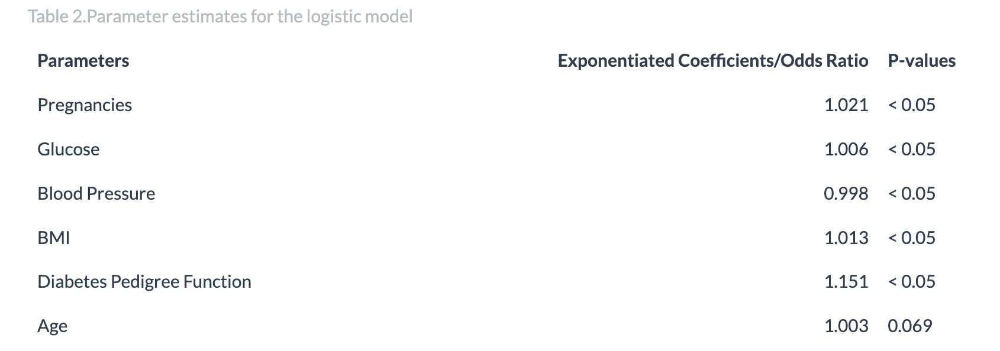

***Section 1***

**Introduction**

At one time, diabetes was always referred to as a disease of the elderly, yet in fact the incidence of diabetes in young people has increased by nearly 70% in the last decade. With the improvement of living standard, material life grows richer, various snacks and high-sugar beverages appear in the market, resulting in the youth’s distaste for plain water. Moreover, the popularity of computers and the internet has significantly reduced the youths’ outdoor exercises frequencies leading to lack in physical activities. Besides, since the youths usually live a fast-paced life, they often stay up late and suffer from serious long-term mental tension, which increases the secretion of hormones that raises blood glucose in the body, such as glucocorticoids and adrenaline. As a result, the prevalence of diabetes increases dramatically among young people nowadays.

In addition, epidemiological studies have found that people with diabetes are more than twice as likely to develop cardiovascular disease as non-diabetics, including premenopausal women, a group that is generally at lower risk for cardiovascular disease. Although diabetes affects men and women equally, women are more severely affected by its consequences. Women are more susceptible to blindness due to diabetic retinopathy compared to men. Pregnancy may worsen pre-existing diabetic retinopathy and kidney disease. Women with diabetes are four times more likely to have a stroke than non-diabetes. Besides vulnerability to diabetes, women also have less access to healthcare services especially in low-income countries where economic, political, and social discrimination is severe. As a result, compared to men, women are more vulnerable, have less access to treatment and health care, and less support to cope with the consequences of diabetes.

Therefore, this project aims to find a model to **diagnostically predict whether a female patient has diabetes based on diagnostic measurements included in the dataset with the hope of increasing prodromal care before getting the disease and promoting health keeping behaviors**.

**Data**

We use one dataset drawn from Kaggel which is originally from the National Institute of Diabetes and Digestive and Kidney. Our dataset includes **768 observations for 9 varibles**. The objective of this dataset is to predict diabetes diagnostically, based on the medical measurements in the data. This dataset contains eight independent medical predictors which might be associated with diabetes occurrence and **one dependent variable outcome**. The data source is female patients at least 21 years old of Pima Indian heritage.

**Results**

*Addtional information* : link to website summary of the project [GitHub](https://tristaaazjy.github.io/jz3571_project.github.io/index.html)

***Section 2***

- Describe the difference between `cd`, `cd ..`, and `cd ~`.
  `cd` changes the current working directory to the user's home directory if directory argument is not speccified. If a directory is specified, it changes the current working directory to the specified directory.
   `cd ..` changes the current working directory to its parent directory, moving one directory level up in the directory hierarchy.
   `cd ~` changes the current working directory to the user's home directory, regardless of the current directory.
  
- What is the purpose of the `chmod` command?
  The purpose of `chmod` is to secure the file system by setting permissions about who can read, modify, or execute files.
  
- How would you display the value of the PATH environment variable?
- In the current folder, you have hunderds of files in `.csv`, `.log`, `.out` format.
    - How to count the line numbers of each `.csv` file?
    - How to print the last line of each `.log` file?
    - How to print a list of `.out` files that contains `Error` somewhere in the file, and also print the line that includes `Error`?
- How would you print the second column of a space-separated file (for example, `test_data.out`) using `awk`?
- Describe the difference between `ps`, `top`, `htop` commands.
