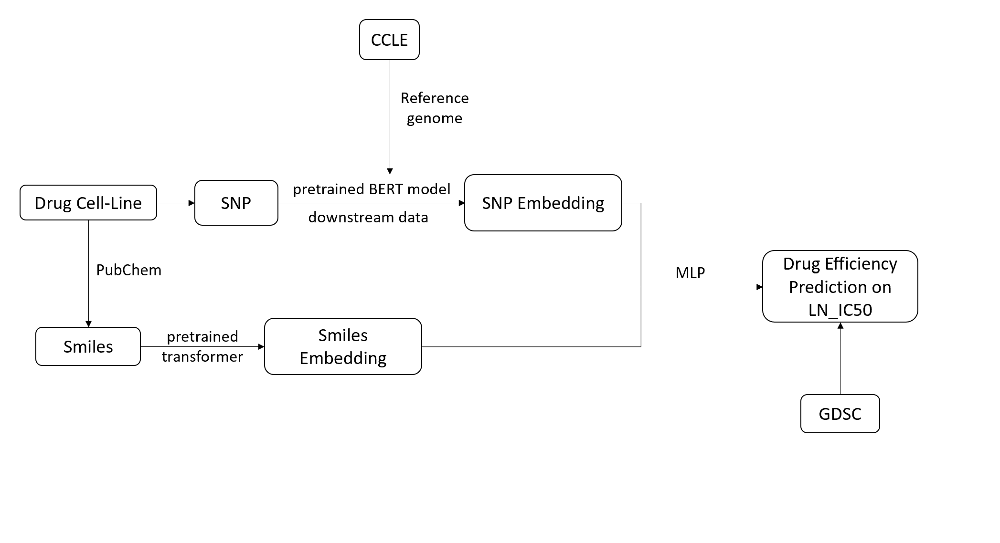

# Research: Large Language Model on Genetic Data

This is a project I have been working on with *Yutian Chen* and *Jiannan Yang* since Feb 2023, when we were all students from City University of Hong Kong.

## Project Objectives
 -   Introduce large language models to the training on genetic data and utilize this model for some down-stream tasks.
 -   Pre-training on the single-cell data.
     -   Self-supervised learning
     -   Large language model: BERT, Transformer
     -   Genetic data (TCGA and [COSMIC](https://cancer.sanger.ac.uk/cosmic/archive-download)…)
     -   Code: HuggingFace Transformers
 - Pre-training on chemical structures (SMILE).
- **Down-stream task:** predict drug efficiency with pre-trained embeddings of cell lines and chemical structures, based on drug sensitivity data from [GDSC](https://www.cancerrxgene.org/).

## Diagram

## Some Test Results
| cell_line_name | drug_name  | y_true      |   y_pred   |
|----------------|------------|-------------|------------|
|KARPAS-299      |Avagacestat |4.522318     |0.88246083  |
|PC-14           |Ruxolitinib |3.676743     |0.8455716   |
|SK-N-SH         |Phenformin  |8.259168     |0.90135914  |
|KALS-1          |Shikonin    |0.109809     | 0.8448139  |  
|BHT-101         |AZD7762     |0.705439     |0.87215304  |

> Our result is far from satisfactory, so we are still working on it.

## References

- [SNP2Vec: Scalable Self-Supervised Pre-Training for Genome-Wide Association Study](https://arxiv.org/pdf/2204.06699.pdf)
- [ContIG: Self-supervised Multimodal Contrastive Learning for Medical Imaging with Genetics](https://openaccess.thecvf.com/content/CVPR2022/papers/Taleb_ContIG_Self-Supervised_Multimodal_Contrastive_Learning_for_Medical_Imaging_With_Genetics_CVPR_2022_paper.pdf)
- [Multi-modal Self-supervised Pre-training for Large-scale Genome Data](https://openreview.net/pdf?id=fdV-GZ4LPfn)
- [Self-supervised learning in medicine and healthcare](https://www.nature.com/articles/s41551-022-00914-1)
- [DeepViFi: detecting oncoviral infections in cancer genomes using transformers](https://dl.acm.org/doi/abs/10.1145/3535508.3545551)

# Shell questions

## Describe the difference between `cd`, `cd ..`, and `cd ~`.

`cd particular-directory` is commonly used to change the current working directory to a particular directory. Sometimes when used without specifying a destination directory, `cd` can change the current working directory to the user's home directory (`/home/username`).
`cd ..` is used to change the current working directory to its parent directory.
`cd ~` can change the current working directory to the user's home directory (`/home/username`), which is identical to `cd` used alone. 

## What is the purpose of the `chmod` command?
The purpose of `chmod` command is to change the file mode of a file or directory, in terms of the access permissions (read, write, execute) for different sets of users (owner, group, others). 

## How would you display the value of the PATH environment variable?

     echo $PATH

## In the current folder, you have hunderds of files in `.csv`, `.log`, `.out` format.
### How to count the line numbers of each `.csv` file?

    wc -l *.csv

### How to print the last line of each `.log` file?

    tail -n 1 *.log
### How to print a list of `.out` files that contains `Error` somewhere in the file, and also print the line that includes `Error`?

    find . -type f -name "*.out" -exec grep -Hn "Error" {} +

## How would you print the second column of a space-separated file (for example, `test_data.out`) using `awk`?

    awk '{print $2}' test_data.out

## Describe the difference between `ps`, `top`, `htop` commands.
`ps` provides a static table of the processes running currently, with PID (process ID), TTY (the associated terminal ), TIME (the CPU time used), CMD (the command that launched the process) as columns.
`top` provides a dynamic table of the processes running currently, with USER, PR, NI, VIRT, RES,    SHR, S, %CPU,  %MEM,  TIME+, COMMAND as columns. Compared with `ps`, `top` also displays overall system statistics, such as CPU, memory usage, and swap usage. It is also interactive and can accept user inputs.
`htop` provides a more user-friendly (colorful) dynamic table of the processes running currently. The output has PID, USER, PR, NI, VIRT, RES,    SHR, S, %CPU,  %MEM,  TIME+, COMMAND as columns, which is a combination of the info provided by `top` and `ps`. It also has overall system statistics, but it visualizes the statistics into bars, which is more intuitive than `top`.
